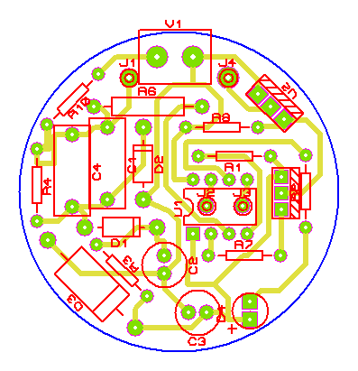

# Artificial sunrise

This PIC-based circuit is used for smooth ignition of incadescent lamp, which imitates the sunrise. Especially useful for making morning wake-up easier.
The circuit don't have turn on timer, it starts the ignition right after turning in the supply.

The schematic, the PCB and firmware source is in Protues 8.7 project. The repository also contains firmware source, schematic diagram and PCB drawing as separate files.

## Schematic
The schematic is based on [this](http://smartelectronix.biz/publ/kontroller_osveshhenija_dlja_ptichnika/1-1-0-85) circuit.

The microcontroller is PIC12F675, but PIC12F629 should match without changing firmware and PCB.
Resistors should bear at least 400V. Electrolytic capacitors should be for 16V voltage at least. Zener diode D3 should be reliable enough and soldered well, because breaking the circuit will cause high voltage to the PIC and electrolytes, which is dangerous.
The R10 resistor is a fuse.
D1 and D2 could be any diodes with reverse voltage not less than 400V.
Q1 is any bipolar p-n-p transistor with allowable voltage not less than 400V.
U2 thyristor should bear 400V and have maximum power rating corresponding to load (lamp) used.

## Printed curcuit board
Here is round (23mm) version of PCB for this circuit (far from perfect though).

The PDF template for printing is [here](./sunrise.PDF)
It's suitable for placing in lanterns with E27 mount.

## Controller firmware
The general program structre is as follows. The interput is set up on GP4 level change. So, the interrupt triggers when mains voltage crosses zero.
ISR starts timer 1, and timer delay gradually decreases over starts. 
In turn, when timer 1 runs out, the interrupt is triggered. This ISR sends thyristor open signal (a short impulse).
Timer delay decreases at square law in order to make lamp ingition more steady. This simple [MATLAB script](./matlab.m) can be used for fitting parameters to achieve required ignition time. It's about 20 minutes currently.

# Искусственный рассвет

Схема плавного включения лампы накаливания для имитации рассвета на основе микроконтроллера PIC. Особенно полезно для облегчения просыпания по утрам.
Схема не имеет встроенного таймера включения, и начинает розжиг лампы сразу после подачи сетевого напряжения!

Схема, плата и исходники прошивки находятся в проекте Proteus 8.7. Также в репозитории есть отдельно исходники прошивки, чертежи схемы, печатной платы и PDF-файл печатной платы.

## Схема
За основу была взята [эта](http://smartelectronix.biz/publ/kontroller_osveshhenija_dlja_ptichnika/1-1-0-85) схема.

Контроллер - PIC12F675, но в теории должен подойти и PIC12F629 без доработки скетча и платы.
Резисторы лучше выбирать с минимальным допустимым напряжением не менее 400В. Электролитические конденсаторвы в цепи питания - 16В и выше. Стабилитрон лучше выбрать помощнееи и надёжно пропаять, поскольку при его обрыве на контроллер и конденсаторы попадает высокое напряжение.
R10 - предохранитель.
Диоды D1 и D2 - любые с допустимым обратным напряжением не менее 400В.
Транзистор Q1 - любой биполярный p-n-p с допустимым обратным напряжением не менее 400В.
Тиристор U2 - любой на напряжение не менее 400В и мощность, соответствующую мощности нагрузки.

## Печатная плата
Вариант круглой платы диаметром 23 мм (далёкий от совершенства)

Шаблон для распечатки [здесь](./sunrise.PDF).
Такой вариант подходит для размещения в светильниках под патроном E27.

## Прошивка
Общая структура программы сводится к следующему - настраивается прерывание на изменение уровня на выводе GP4. Прерывание, таким образом, происходит в момент перехода сетевого напряжения через 0.
Обработчик прерывания по переходу сети через 0 запускает таймер 1 с постоянно уменьшающейся от запуска к запуске задержкой. 
В свою очередь, по истечении таймера срабатывает прерывание, обработчик которого подаёт сигнал на открывание тиристора (короткий импульс).
Величина задержки уменьшается по квадратичному закону, чтобы визуально разжигание лампы было более плавным. В простом [скрипте для MATLAB](./matlab.m) можно подобрать параметры, чтобы обеспечить требуемое время разжигания. Сейчас оно порядка 20 минут.
